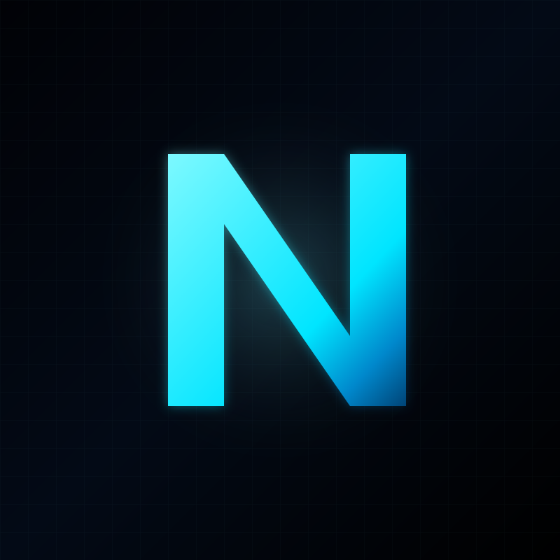

# NEXTCLIENT

<p align="center">
  
</p>

**A neon, open-source GeForce NOW client for Android, Linux, and Windows — a Flutter port of [OpenNOW](https://github.com/OpenCloudGaming/OpenNOW).**

NEXTCLIENT is a from-scratch Dart/Flutter rewrite of the OpenNOW Electron
client, built around a custom-built, hardware-accelerated streaming pipeline
(VAAPI zero-copy on Linux) and a dark neon UI.

> [!WARNING]
> Under active development. Expect rough edges, especially around the native
> hardware-decode transports.

> [!IMPORTANT]
> NEXTCLIENT is an independent community project and is not affiliated with,
> endorsed by, or sponsored by NVIDIA. NVIDIA and GeForce NOW are trademarks
> of NVIDIA Corporation. You must use your own GeForce NOW account.

---

## Features

- **Catalog** — browse the GFN catalog (GraphQL), featured carousel, search,
  recently played, and game-details pages with store-variant pickers.
- **Stream shader filters** — live GPU post-processing on the stream video:
  CAS sharpening (edge-aware, or a uniform unsharp mask), saturation,
  contrast, brightness, vibrance, and animated film grain, adjustable during
  a session (GPU renderer path).
- **Sign-in** — browser-based OAuth with a local redirect server (PKCE) plus a
  device-login flow; tokens are persisted and auto-refreshed.
- **Sessions** — launch with live lifecycle feedback
  (requesting → queued → allocating → ready), resume an active session after an
  app restart, or terminate it remotely to free the server slot.
- **Streaming** — WebRTC with three selectable transports and VAAPI
  hardware decode + zero-copy render on Linux (below).
- **Input** — OS pointer lock for FPS-style mouse look, sensitivity /
  acceleration / sub-pixel precision tuning, client-rendered cursor overlay
  (including custom bitmap cursors from the WebRTC cursor channel), touch
  input for touchscreens, a virtual gamepad overlay, and physical gamepad
  support on Android.
- **Queue picker** — before launch, a free-tier server picker powered by
  printed-waste community data shows live queue positions and ETAs per zone
  (with pings), flags nuked zones, and lets you route the session to the
  best queue (port of OpenNOW).
- **Subscription** — shows your GFN tier, remaining hours, and entitled
  resolutions.
- **Quality controls** — resolution, FPS, bitrate, codec (H.264/HEVC/AV1),
  color quality, keyboard layout, game language, L4S, and G-Sync settings sent
  to the server on launch; plus advanced client-side WebRTC settings
  (ICE policy, bundle, rtcp-mux, hardware acceleration, STUN, DSCP, IPv6).
- **Neon UI** — dark theme with selectable animated background styles
  (Subtle, Glow, Beams, Pulse, Aurora), auto-adaptive portrait bottom-nav vs.
  landscape sidebar layout, and an optional hidden title bar.
- **Diagnostics** — in-stream stats overlay (decode/render backend, FPS,
  network), session timer, and an in-app log viewer fed by a redacted HTTP
  logger (sensitive query parameters are scrubbed before anything is logged).

## Platform support

| Platform | Status |
|---|---|
| Android | ✅ Supported — decode is already handled by flutter_webrtc (platform hardware codecs) |
| Linux | ✅ Supported — VAAPI hardware decode + zero-copy render |
| Windows | 🚧 Builds and streams, but GPU decode isn't solved yet — runs FFmpeg software decode for now |
| macOS | ❓ Untested — I have no Mac (a CI job exists, but nothing has been validated) |
| Web | ❌ Not built — the app depends on `dart:ffi`, GStreamer, and native plugins |

CI (`build.yml`) builds **Linux, Windows, and Android** on every push; a
macOS job exists in the matrix but is unverified (I have no Mac ), and web
is deliberately excluded.

## Architecture

```
.
├── lib/                         Flutter app (Dart)
│   ├── pages/                   home, library, game details, login, launcher
│   │                            (play flow + store picker + queue picker), settings,
│   │                            stream, log viewer
│   ├── state/                   session controller, user settings, stream
│   │                            transports, mouse/keyboard input, cursor overlay,
│   │                            stats, physical gamepad, title-bar controller
│   ├── widgets/                 neon UI kit, gamepad widgets, stream widgets
│   ├── theme/neon.dart          neon theme + animated background styles
│   └── utils/                   shared helpers (friendly error messages)
├── packages/
│   ├── gfn_core/                pure-Dart GFN API client (auth, catalog,
│   │                            cloud-match, signaling, session, subscription)
│   ├── flutter_webrtc/          vendored fork, patched for VAAPI decode +
│   │                            GPU-shader video renderer
│   └── pointer_lock/            vendored pointer-lock plugin (mouse capture)
├── native/                      libwebrtc build tree + FFI bridges
│   ├── gst_bridge/              GStreamer webrtcbin bridge over dart:ffi
│   └── nvst_bridge/             classic NVST UDP video bridge
├── vaapi_patch/                 Linux wrapper patch (VAAPI decoder, dmabuf)
├── d3d11_patch/                 Windows wrapper patch (D3D11 decoder)
└── .github/workflows/           build matrix + custom-libwebrtc Windows CI
```

### Streaming pipeline

The stream page drives input and video through a uniform
`StreamTransport` interface. Three transports are implemented and switchable
in Settings → WebRTC:

| Transport | Path |
|---|---|
| `flutterWebrtc` (default) | stock `flutter_webrtc` plugin + `RTCVideoRenderer`; on Linux this layers the custom-built `libwebrtc.so` (VAAPI decode + dmabuf) |
| `webrtcbinFfi` | native GStreamer `webrtcbin` bridge over `dart:ffi` (`native/gst_bridge`) — hardware decode without a custom libwebrtc build |
| `nvstGstreamer` | classic NVST UDP video via `native/nvst_bridge` + GStreamer hardware decode; WebRTC is kept for SCTP input |

Decode and render backends are independently selectable:

- **Decode** — `vaapi` (GStreamer VAAPI `vah264dec` on Linux) or `ffmpeg`
  (forced software). Windows currently runs the FFmpeg software path until
  the D3D11VA decoder lands; Android decodes automatically via the platform
  (no custom build). Applied per-session via `OPENNOW_DECODER`.
- **Render** — `cpu` (libyuv `ConvertToARGB` into a Flutter texture) or `gl`
  (Y/U/V planes uploaded as GPU textures, YUV→RGB in a shader — GL on Linux,
  D3D11 shared-handle on Windows — zero CPU readback). Applied via
  `OPENNOW_RENDERER`.

See [`native/README.md`](native/README.md) for the daily rebuild workflow of
the custom libwebrtc, [`vaapi_patch/README.md`](vaapi_patch/README.md) for the
Linux build from scratch, and [`d3d11_patch/README.md`](d3d11_patch/README.md)
for the Windows counterpart.

## Getting started

Requires Flutter 3.44.7+ (Dart SDK ^3.12.2).

```bash
flutter pub get
flutter run -d linux    # or -d windows / -d <android-device>
```

Release builds:

```bash
flutter build linux --release
flutter build windows --release
flutter build apk          # Android
```

### Incremental release rebuilds (Linux)

`flutter build linux --release` is a full build. Once it has run at least once
(the `build/linux/x64/release` dir exists), you can rebuild **just one
plugin's native code** in place with ninja — release (optimized) mode, not
debug:

```bash
# After editing C++ in a plugin (e.g. packages/flutter_webrtc), rebuild only
# that plugin's .so inside the release build tree:
ninja -C build/linux/x64/release flutter_webrtc_plugin
#   [4/4] Linking CXX shared library plugins/flutter_webrtc/libflutter_webrtc_plugin.so

# Then a quick `flutter build` re-bundles the fresh .so into the app
# (ninja is incremental, so this finishes fast):
flutter build linux --release
```

- Targets are named `<plugin>_plugin` (e.g. `flutter_webrtc_plugin`,
  `pointer_lock_plugin`); list them with
  `ninja -C build/linux/x64/release -t targets all | grep plugin`.
- Always use `build/linux/x64/release` — the release app ships the release
  artifacts, so rebuilding `build/linux/x64/debug` does nothing for it.
- This covers **native (C++)** plugin changes. Dart-only changes still need a
  `flutter build` / `flutter run` (that path is incremental too — the kernel
  snapshot is cached).
- The custom libwebrtc `.so` itself (VAAPI decode) builds separately, in
  `native/libwebrtc_build/` — see [`native/README.md`](native/README.md).

**Troubleshooting `file INSTALL cannot find …/build/lib/libapp.so`** — the
Dart AOT snapshot is missing. Usually caused by interrupting a build
(Ctrl+C) mid-kernel-snapshot (leaves a 0-byte `app.dill` that the incremental
check treats as fresh) or by the `_phony_` assemble marker leaking into the
build tree — it must never exist (see `linux/flutter/CMakeLists.txt`).
Quick fix, keeps the build incremental:

```bash
rm build/linux/x64/release/flutter/_phony_
rm -rf .dart_tool/flutter_build/<current-build-id>   # or just: flutter clean
flutter build linux --release
```

> [!NOTE]
> The Linux release app ships a **locally built** `libwebrtc.so` vendored into
> `packages/flutter_webrtc/third_party/libwebrtc/`. The stock plugin download
> is skipped whenever that vendored `.so` is present. `flutter pub get` can
> re-extract the plugin and reset it — verify with
> `grep -c 'memory:VAMemory' packages/flutter_webrtc/third_party/libwebrtc/lib/libwebrtc.so`
> (must be > 0) after any `pub get`.

## License

MIT — see [`LICENSE`](LICENSE). This project is a port/derivative of
[OpenNOW](https://github.com/OpenCloudGaming/OpenNOW) (MIT, © 2025 Zortos) and
vendors modified `flutter_webrtc` and `pointer_lock` packages. Full
attributions are in [`THIRD_PARTY_NOTICES.md`](THIRD_PARTY_NOTICES.md).
